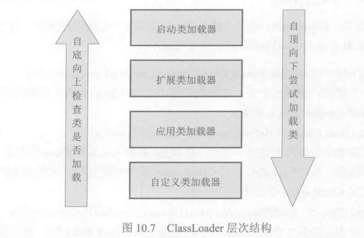

## 1.volatile原理
- 答：禁止变量缓存到CPU CACHE，读取时从主内存读取，对所有线程可见。写入时会加入屏障，禁止指令重排序

## 2.HashMap扩容问题，哪些操作导致扩容
- 当前数据存储的数量（即size()）大小必须大于等于阈值；当前加入的数据是否发生了hash冲突。
- putVal，putMapEntries

## 3.JAVA容器
- 并发：Concurrent(5),CopyOnWrite(2)
- 同步：Vector、Stack、HashTable。Collections.synchronizedXX()
- BlockingQueue（3），Deque（1）,Queue（3）

## 4.反射原理，注解原理
- 编译时类型信息已知，运行时通过检查类的类型信息匹配CLASS对象
- 通过反射获取注解原信息，@Retention(RetentionPolicy.RUNTIME)

## 5.类的加载过程
- 加载->链接（验证，准备，解析）->初始化
- 使用->卸载
- 双亲机制：尝试加载类时会先请求双亲，请求失败则会自己加载
- 
- 

## 6.JVM内存模型
- 
- 

## 7.树结构解析
- [二叉平衡树，B+树](https://blog.csdn.net/u011240877/article/details/80490663)
- [B+树，B*树](https://blog.csdn.net/pengzhisen123/article/details/79927377)

## 8.JVM调优工具
- [JVM监控](https://blog.csdn.net/xybelieve1990/article/details/53516437)
- jvisualvm，jps，jinfo。查看和调整虚拟机参数
- jmap，jhat。生成heap dump文件
 还阔以使用-XX:+HeapDumpOnOutOfMemoryError参数来让虚拟机出现OOM的时候·自动生成dump文件。
- jstat。查看JVM运行时状态信息的命令
- jstack。查看线程快照

        NEW,未启动的。不会出现在Dump中。
        
        RUNNABLE,在虚拟机内执行的。
        
        BLOCKED,受阻塞并等待监视器锁。
        
        WATING,无限期等待另一个线程执行特定操作。
        
        TIMED_WATING,有时限的等待另一个线程的特定操作。
        
        TERMINATED,已退出的。

 - [线程状态示意图](./线程状态图.jpg)